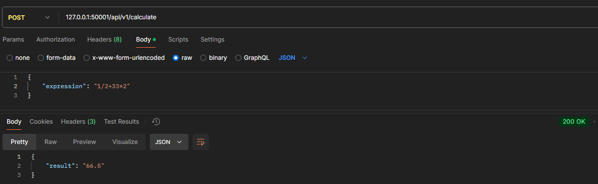
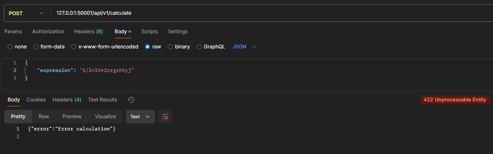
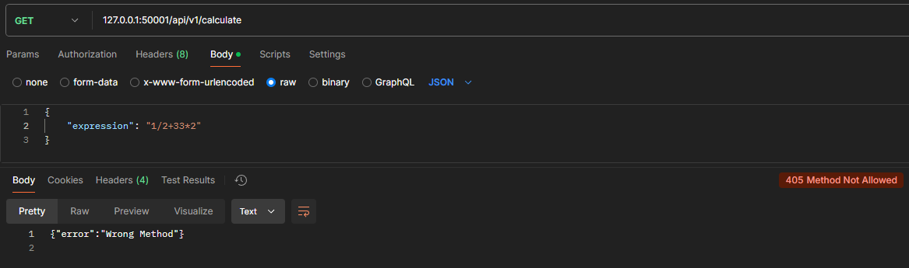

# Калькулятор на HTTP сервере, написанный Golang

В проекте разрешены умножение, сложение, вычитание, деление, а также использование скобок.
Для работы удобно будет использовать Postman

В проекте не реализован унарный плюс, унарный минус и дробный числа во входных данных.

## Endpoint сервера

/api/v1/calculate

# Запуск проекта

Проект поддеживает запуск как отдельное приложения, так и в docker контейнере.

## Запуск как приложение

### 1. **Установить [Golang](https://go.dev/dl/)**
### 2. **Сохранить себе [репозиторий проекта](https://github.com/Lexantes/calc-web-alex)** 
```powershell
git clone https://github.com/Lexantes/calc-web-alex
```
### 3. **Перейти в директорию**
```powershell
cd calc-web-alex
```
### 4. **Прописать команду для запуска сервера**
```powershell
go run ./cmd/main.go --port 50001
```

После `--port` можно указать желаемый порт на котором запустить сервер. По умолчанию запускается на `30001`

### 5. **Все работает, если вы получили такое сообщение:**
```Go
2024/12/22 20:36:04 Server started on 50001 port
```

## Запуск в контейнере

Для запуска надо иметь docker на компьютере. Внутри контейнера открывается 8080 порт.

### 1. Собрать контейнер

Надо находиться в корне репозитория.

```bash
docker build -f Dockerfile -t calc-web:v1 .
```
### 2. Запуск контейнера
```bash
docker run -d --rm --name alex-calc-web -p 50001:8080 calc-web:v1
```

# Статусы сервера

## 200 - OK
Все корректно работает


## 422 - StatusUnprocessableEntity 
Входные данные некорректны, возможно введены какие-то лишние символы


## 405 - StatusMethodNotAllowed
Если метод не POST


## 500 - StatusInternalServerError
В случае иной ошибки